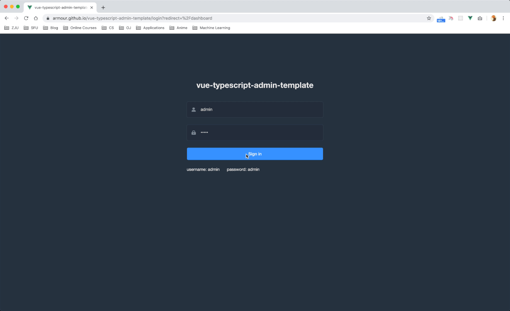

# element3-admin-ts-template

[English](./README.md) | 简体中文

## 总览

> 这是一个极简的利用 vue 结合 element3 搭建的管理后台。它只包含了 element3 & axios & svgicon & permission control & lint，这些搭建后台必要的东西。


## 截图/动图




## 相关项目

- [element3-admin-template](https://github.com/hug-sun/element3-admin-template)

- [element3-admin](https://github.com/hug-sun/element3-admin.git)

- [element3-admin-ts-template](https://github.com/hug-sun/element3-admin-ts-template.git)


## 如何设置以及启动项目

### 安装依赖

```bash
npm run install
```

### 启动本地开发环境（自带热启动）

```bash
npm run serve
```

### 构建生产环境 (自带压缩)

```bash
npm run build
```

### 代码格式检查以及自动修复

```bash
npm run lint
```

### 运行单元测试

```bash
npm run test:unit
```

### 自定义 Vue 配置

看这里 [Configuration Reference](https://cli.vuejs.org/config/).

## 浏览器支持

Modern browsers and Internet Explorer 10+.

| [](http://godban.github.io/browsers-support-badges/)</br>IE / Edge | [](http://godban.github.io/browsers-support-badges/)</br>Firefox | [](http://godban.github.io/browsers-support-badges/)</br>Chrome | [](http://godban.github.io/browsers-support-badges/)</br>Safari |
| --------- | --------- | --------- | --------- |
| IE10, IE11, Edge| last 2 versions| last 2 versions| last 2 versions
